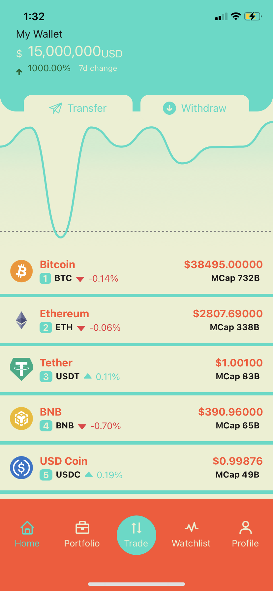
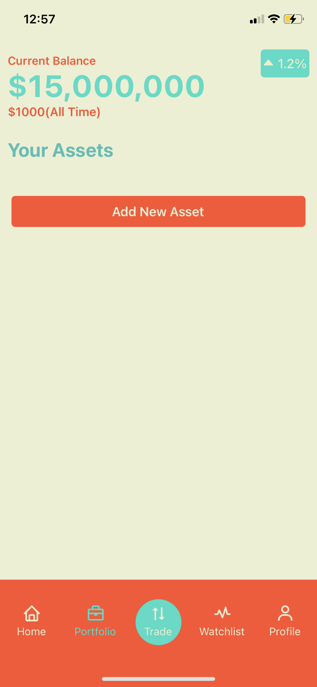
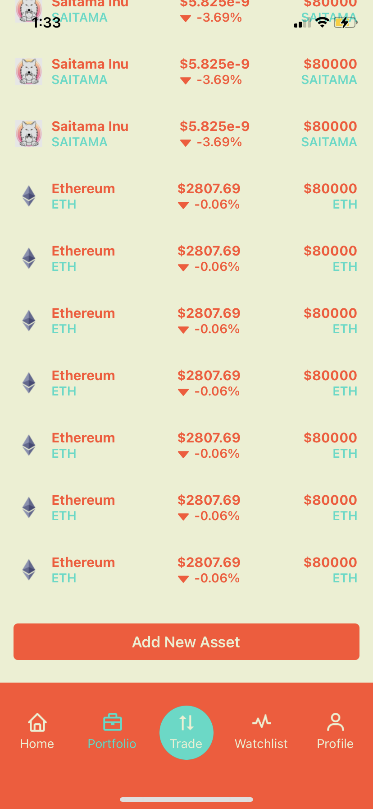
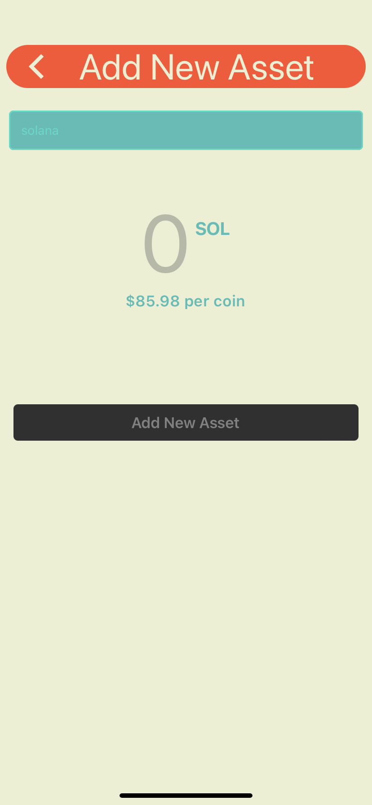
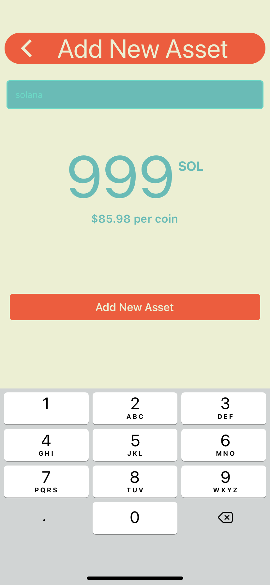
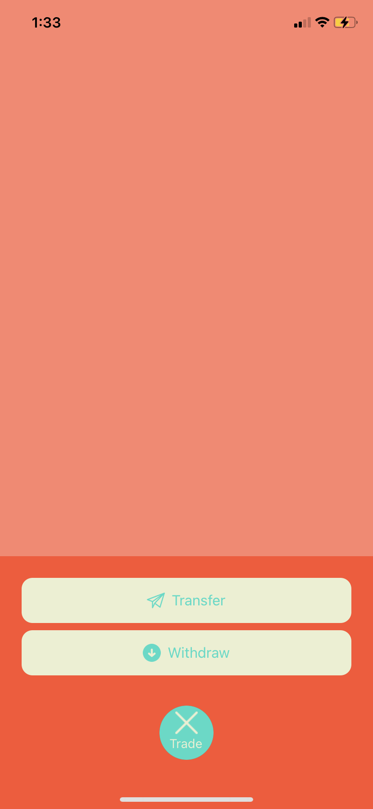
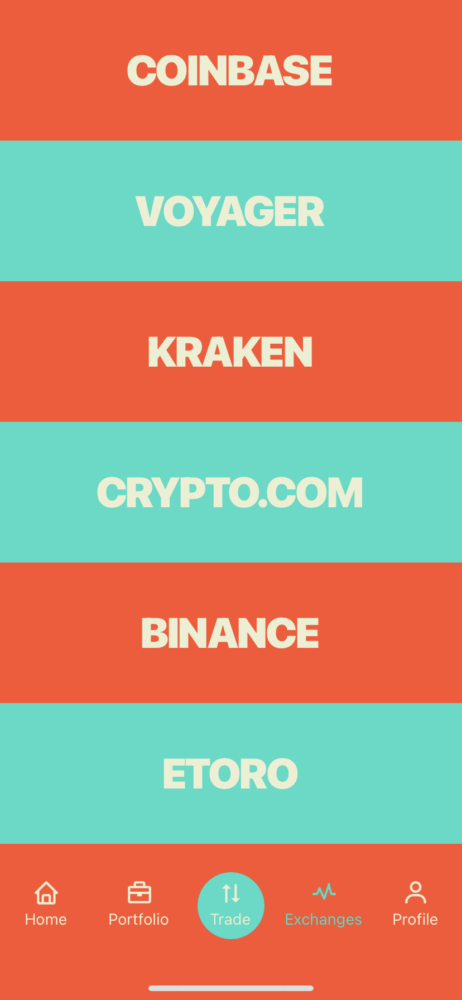
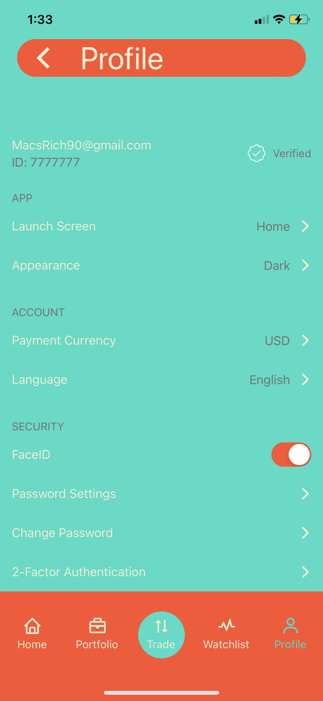

# react-native-KingKrypto 💸

A sweet & simple react-native crypto wallet/tracker that uses coingecko's api, and recoil for state management.

  
  
    
      
        
          
            
             

## Features

React-Native

Redux

Recoil

CoinGecko API
